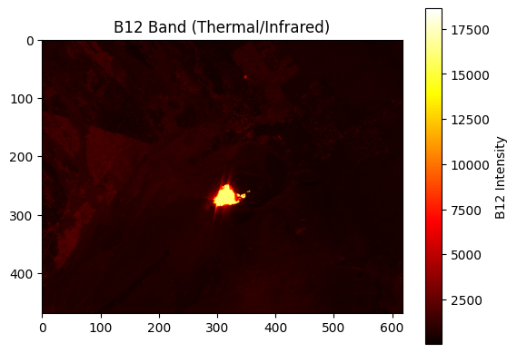
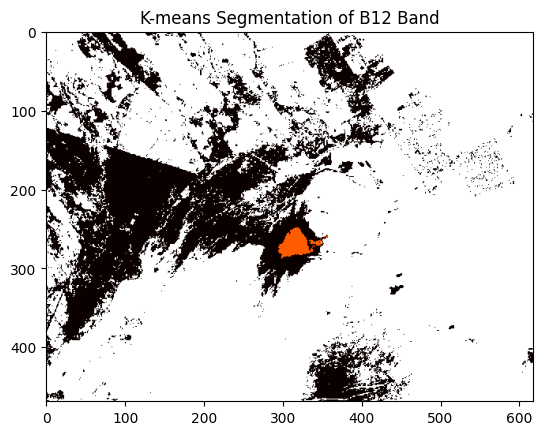
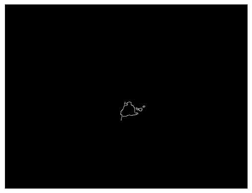

# Kīlauea Volcano Satellite Image Analysis
This repository contains Python scripts for processing and analyzing satellite images of Kīlauea volcano using image processing techniques like clustering and edge detection.

The satellite data is from Google Earth Engine and the script to download it can be found in `satellite_source.js`.

## Analysis plots

### B12 Intensity

### K-means

### Edge filtering
